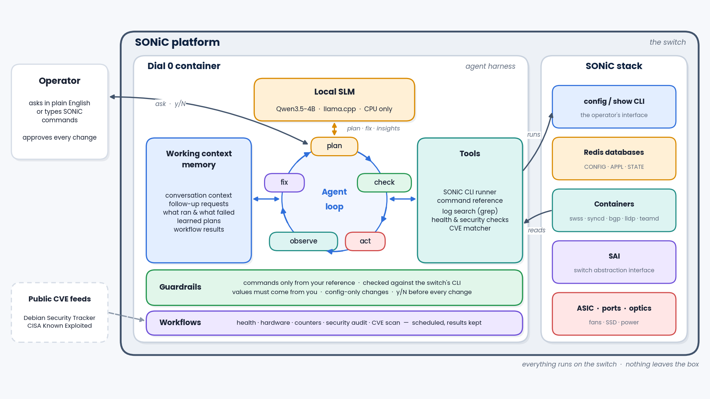

# Dial 0 for SONiC

**Talk to your SONiC switch in plain English, safely, on the switch itself.**

*Built for the OCP 2026 SONiC Hackathon.*

Dial 0 runs entirely on a SONiC switch, in one Docker container: a small local model (Qwen3.5-4B on llama.cpp,
CPU only) plus an **agent harness** that makes the model hard to get wrong. Everything Dial 0 runs is checked first,
and nothing leaves the switch: the model and the switch's data stay on the box.

[](https://github.com/venkatmahalingam/dial0/actions/workflows/tests.yml)



## Why

SONiC has won the industry, and AI networks are pulling it into a much bigger market. But operating it still takes
SONiC expertise most teams don't have:
- every change depends on exact, release-specific syntax;
- answers are spread across containers, counters and logs;
- cloud AI assistants can't be used on isolated management networks;
- a model that invents commands doesn't belong on a production switch.

Dial 0 puts that expertise on the switch, behind guardrails.

## What it does

| | |
|---|---|
| **Configure in plain English** | VLANs, PortChannels, IP addressing, VRFs, anycast gateways, port settings |
| **Follow-up conversations** | each request builds on the last; SONiC errors are worked through automatically |
| **Ask the switch** | status, settings and "which command does..." questions, mostly answered without the model |
| **Health checks** | system, services, hardware, ports, counters, BGP, logs, crashes; on demand or scheduled |
| **Security audit and CVE scan** | configuration weaknesses, and known vulnerabilities in the host and every SONiC container |
| **Model insights** | when a check finds problems, the model explains likely causes and next steps |
| **Blueprints** | template-based configuration, e.g. a leaf or spine of a 2-tier Clos AI fabric |

**How it stays safe** (see [docs/ARCHITECTURE.md](docs/ARCHITECTURE.md)):
- **Your command reference** (`reference/sonic-command-reference.md`) lists the only commands the model may use.
- **Checked against the switch's own CLI code:** commands, options and argument values.
- **Values from you:** IPs, VLANs and ports come from what you asked, not from the model.
- **Config-only changes:** changes go through SONiC's `config`, never Linux tools behind its back.
- **Your approval:** every change is shown first and runs only after your y/N.

## Contents

- [Quick start](#quick-start-on-the-switch) · [Change CPU, RAM and storage](#change-cpu-ram-and-storage) · [Use](#use)
- [When SONiC returns an error](#when-sonic-returns-an-error) · [Health check](#health-check) · [Workflows](#workflows-run-on-demand-or-on-a-schedule)
- [Blueprints](#blueprints-template-based-configuration) · [Security audit](#security-audit) · [CVE scan](#cve-scan)
- [Speed](#speed) · [Day-2](#day-2) · [How it avoids making up commands](#how-it-avoids-making-up-commands) · [Safety](#safety)
- [Troubleshooting](#troubleshooting) · [Project layout](#project-layout) · [Development and tests](#development-and-tests) · [Contributors](#contributors) · [License](#license)

## Quick start (on the switch)

Needs: a SONiC x86_64 switch, `sudo`, internet access from the switch (or a proxy), ~5 GB free disk.

```
git clone https://github.com/venkatmahalingam/dial0.git     # or: tar xzf dial0-sonic.tar.gz && cd dial0-sonic
cd dial0
./setup.sh                     # checks -> builds -> downloads the model -> starts -> installs `dial0`
dial0                          # the dial0> prompt: type requests one after another (/exit to leave)
dial0 "show me the vlans"      # or a single request straight from the shell
```

What it does, in order:
1. **Checks** CPU, RAM, disk, internet, ports, SONiC version and that the model file exists. It stops with a clear message if something is off.
2. **Builds two images** on the switch:
   - a *base* with llama.cpp, Python and the SONiC command index for your SONiC branch (auto-detected, e.g. `202405`);
   - a thin *app* image with the Dial 0 code.
   By default llama.cpp comes from the official prebuilt server image, so nothing is compiled; its CPU code path (AVX2, AVX-512, ...) is chosen at runtime.
3. **Downloads the model** (~3 GB) to `models/` on the switch disk, in parallel with the build. The download is resumable, and the model is mounted into the container read-only rather than stored in the image.
4. **Starts** the container with the CPU/RAM limits from `dial0.conf` (restarts automatically, also after a reboot) and installs `/usr/local/bin/dial0`.

### How long it takes

| What | Time | Why |
|---|---|---|
| First install | ~5-10 min, mostly the 3 GB download | no compiling; download runs during the build |
| Update after extracting a new version of this folder | **~10-30 s** + model reload | only the app image is rebuilt; the base is reused |
| Change model | the download only | no rebuild |
| Change CPU / RAM / context / ports ... | a restart (model reload ~1-3 min) | no rebuild |
| `./setup.sh --rebuild` | a few minutes | rebuilds the base too, pulling the latest llama.cpp |
| `LLAMA_SOURCE=compile` (compile llama.cpp here) | +10-20 min, once | tuned to this CPU; uses all cores but one while compiling |

**Updating from git:** `git pull`, then `./setup.sh` (it rebuilds only what changed). If you changed settings and the
update also changes `dial0.conf`, git stops and asks you to deal with your changes first: run
`git stash && git pull && git stash pop` to keep them.

**Updating from a release tarball:** copy the new `dial0-sonic.tar.gz` next to this folder (or into it), then:
```
dial0 ctl update               # extracts in place, keeps your dial0.conf settings, rebuilds only what changed
dial0 --version                # running build vs this folder: "(up to date)"
```

`setup.sh` is safe to re-run. It rebuilds only what changed: the base when llama.cpp, Python dependencies or the SONiC branch changed, the app when the code changed.

## Change CPU, RAM and storage

```
dial0 ctl set CPUS=2               # use 2 cores (default 1)
dial0 ctl set MEMORY=6g            # RAM limit (default 5g)
dial0 ctl set STORAGE=10g          # disk budget (default 8g)
dial0 ctl set CPUS=2 MEMORY=6g     # several at once
dial0 ctl resources                # what is configured vs. actually used
```

Each change is checked first. For example, the switch must keep at least 1 core, RAM must fit the model and not exceed the switch, and disk must be enough.
A rejected change leaves everything as it was. An accepted change is saved to `dial0.conf` and applied by restarting the container.
There is no rebuild, but the model reload takes a few minutes.

| Setting | Default | Meaning |
|---|---|---|
| `CPUS` | 1 | Cores for Dial 0; also the number of model threads. More cores = faster answers. At least 1 core always stays with SONiC. |
| `CPUSET` | auto | Which cores. `auto` = the highest-numbered ones (1 core -> core 3 on a 4-core switch). Or a list, e.g. `2,3`. |
| `MEMORY` | 5g | Hard RAM limit. The 4B model needs ~4 GB; the 2B model ~2.5 GB. |
| `STORAGE` | 8g | Disk budget: images (~1 GB) + model (~3 GB) + sessions + logs. |

**Storage, honestly:** Docker cannot hard-limit a container's disk on SONiC's ext4 filesystem. Dial 0 enforces the budget itself:
- the build checks free disk first;
- images plus model are checked against `STORAGE`;
- only the current model and the current base image are kept (older ones are deleted);
- logs are capped at 30 MB;
- sessions are capped at whatever the budget leaves (oldest sessions are deleted first);
- build cache is removed.

Most of the disk is the model, so to use much less disk, pick a smaller one. It downloads, restarts and deletes the old model; no rebuild:
`dial0 ctl set MODEL_REPO=unsloth/Qwen3.5-2B-GGUF MODEL_FILE=Qwen3.5-2B-UD-Q4_K_XL.gguf`
Check file names and sizes first with `host/dial0-quants unsloth/Qwen3.5-2B-GGUF`.

**Ports:** Dial 0 uses the switch's network directly and listens only on 127.0.0.1:
- llama.cpp on **18081** (`LLAMA_PORT`);
- the agent API on **8090** (`API_PORT`).

Setup checks both are free and names the process holding a busy port. To change one: `dial0 ctl set LLAMA_PORT=18082`.

All other settings are in `dial0.conf` (commented). Examples:
- `CONFIRM=ask|dry-run|auto`;
- `HTTP_PROXY`/`HTTPS_PROXY`;
- `MCP_SERVER_URL`;
- `LLAMA_SOURCE=prebuilt|compile`, `LLAMA_IMAGE` (pin a release such as `...:server-bNNNN` for reproducible builds).

Build settings (`LLAMA_*`, `SONIC_UTILITIES_REF`, `CPU_TUNE`, `BUILD_JOBS`, proxies) need `dial0 ctl rebuild`.
Model settings download and restart; everything else applies with a restart.

## Use

**Context:** by default every `dial0 "..."` is a fresh request. The model sees nothing from earlier requests, so there are no surprises from old state.
Include earlier requests and the commands they ran only when you want continuity:

```
dial0 "show vlan brief"                       # fresh request (default)
dial0 --context "now add Ethernet4 to it"     # this request sees earlier requests of the session
dial0 -s lab1 "..."                           # a named session; always uses its context (--no-context to skip)
dial0 ctl set CONTEXT=on                      # make context the default
```

**The `dial0>` prompt:** just `dial0`, with no request, opens a prompt, so you don't type `dial0` for every command. Context is on:
each line builds on the ones before, like a conversation. Typed SONiC commands still run directly, with no model involved.

```
$ dial0
Dial 0: type a request or a SONiC command; each one builds on the ones before. /help for commands, /exit to leave.
dial0> create vlan 600
  ... steps, one y/N ...
dial0> add Ethernet4 untagged to that vlan      <- "that vlan" = 600, from the context
dial0> show vlan brief                          <- runs directly, no model
dial0> /history
dial0> /exit
```

| At the `dial0:` prompt | |
|---|---|
| plain text / SONiC command | a request (with the session's context) |
| `/agent <request>` | step-by-step agent mode for this request |
| `/explain <request>` | also explain the output in words |
| `/fresh <request>` | this one request without the context |
| `/why`, `/history`, `/context` | steps of the last request, commands run, what the model gets as context |
| `/reset` | forget this session's context and start over |
| `/reset all` | clear ALL sessions, command history and learned requests (asks first) |
| `/ref <words>`, `/plans`, `/sessions` | command lookup, learned requests, sessions |
| `/verbose on\|off`, `/time on\|off`, `/quiet on\|off` | output detail |
| `/exit`, Ctrl-D | leave (Ctrl-C clears the line) |

Follow-ups work: "add it as tagged instead" is read together with the previous request. The model is shown the
commands that request ran, and SONiC's error if one failed (e.g. "already untagged member of Vlan100"), even though
the follow-up itself names no command.

The context is kept, so `dial0` next time continues where you left off.
Entering the prompt on a terminal shows the Dial 0 banner: the logo, a title line, and live facts
(how many commands it may use, whether changes ask y/N, which model). Plain ASCII, under 80 columns. It's skipped for
piped input and with `-q`; `dial0 ctl set BANNER=off` turns it off.
Use `dial0 --new` to start clean, or `dial0 -s lab1` for a separate named session.
A named session shows its name in the prompt (`dial0 [lab1]>`). Options work here too, e.g. `dial0 -v` for detailed steps.
Line editing and command history (arrow keys) work, and the history is kept across restarts.

**Single requests:**
```
dial0 "show vlan brief"                       # a real SONiC command: runs directly, no model involved
dial0 "create VLAN 100 with Ethernet1 untagged"   # plain English: 1 model call (0 if learned), then the commands run
dial0 -e "is Ethernet4 up?"                   # also explain the output in words (+1 model call)
dial0 -a "why is the BGP session to 10.0.0.2 down?"   # agent mode: step by step, reads output (slow)
dial0 -q "..."                                # quiet: hide the steps (they're shown live by default)
dial0 why                                     # replay the last request's steps, with details
dial0 -t "..."                                # show where the time went; -v = steps with details + timing
dial0 -s vlan-work resume                     # answer a y/N question left open
dial0 sessions | context | history | reset | rm NAME
dial0 reset --all                             # clear ALL sessions: context, command history, learned requests (asks; -y skips)
dial0 ref find vlan member                    # look up real SONiC commands yourself
```

**Ask about commands:** "which command adds an ip address to a vlan?" or "search for the correct command" is answered
straight from the SONiC command reference, with no model call. If it names nothing specific, it looks up your previous request.
When the model finds no fitting command, you get the closest real ones to type directly.

**Learned requests are not context.** A request that ran successfully before is reused without the model (see Speed).
That's a lookup of the same request, not memory of what you did; turn it off with `dial0 ctl set LEARN=off`.

Example. By default you see what Dial 0 is doing, live, while you wait:
```
$ dial0 "create VLAN 100 with Ethernet1 untagged"
What Dial 0 is doing:
  [   0.0s] Searched the SONiC command reference: 8 relevant command(s), e.g. config vlan add, config vlan member add, ...
  [   0.0s] Asking the model which of these fit the request (~470 tokens to read; on one CPU this can take a minute or more).
  [  41.7s] Model answered in 41.7s, 402 from cache.
  [  41.7s] Model's reasoning: config vlan add creates VLAN 100, config vlan member add -u adds Ethernet1 untagged, show vlan brief verifies.
  [  41.7s] Model proposed: config vlan add 100 | config vlan member add -u 100 Ethernet1 | show vlan brief
  [  41.7s] Checked against the SONiC reference: all 3 command(s) exist with valid options.
  [  41.7s] 2 of 3 command(s) change the switch configuration, so they need your approval (one y/N for all).
Creates VLAN 100 with Ethernet1 untagged.
Will run on the switch (3 commands, all at once):
  * config vlan add 100
  * config vlan member add -u 100 Ethernet1
    show vlan brief
Apply? (* = changes config) [y/N] y
  [   0.0s] You approved.
  [   0.0s] Running 3 command(s) on the switch in one batch, in order.
  [   6.2s] Finished in 6.2s: all 3 command(s) succeeded.
$ config vlan add 100
$ config vlan member add -u 100 Ethernet1
$ show vlan brief
...
```

## When SONiC returns an error

Dial 0 doesn't stop at the first error:
- **"Already done" errors** ("Vlan100 already exists" after `config vlan add 100`): the step counts as done and the rest
  of the batch you approved continues. No model call, no new y/N. This only applies if the error is about the same
  VLAN/port/IP; "PortChannel100 is already untagged member of Vlan100" while adding it to VLAN 40 is a real conflict.
- **Real errors** go back to the model with your request, what succeeded, SONiC's exact error and what didn't run. It
  proposes the commands that still need to run (or asks you, if the fix needs your decision, such as removing members
  first). You see what failed, then one y/N for the fix.
- Up to `FIX_ROUNDS` (default 3) such rounds, then it stops with the last SONiC error.

## Health check

Ask in plain words ("is the switch healthy?", "any errors or warnings?", "check the system status"), or run
`dial0 health` (`/health` at the prompt). Read-only, no model call: code reads every output, so the verdict is never made up.

```
Switch health: CRITICAL (3 critical, 4 warning(s))   [SONiC.202505.0-test, up 3 days, 2:01]
  [CRIT] System health: LED red, services Not OK (Not Running: snmp), hardware OK
  [CRIT] Containers: not running: syncd (Exited (1) 2 hours ago)
  [CRIT] Logs: last 20000 lines of /var/log/syslog: 2 critical, 5 errors, 3 warnings. Most frequent critical: ...
  [warn] Interfaces: 1 of 2 enabled ports are down: Ethernet8
  [warn] BGP: 1 of 2 neighbors not established: 10.0.0.59 (Active)
  [warn] Resources: disk / 91% used, memory 43% used, load 0.73
  [warn] Crashes: 1 core dump(s) in the last 7 days: orchagent.1727670000.123.core.gz
```

What it checks:
- `show system status`: must say "System is ready", else the services/containers not OK, with their reason;
- `show platform ssdhealth`: no error lines;
- `show platform fan`: Status OK for every fan;
- `show interfaces transceiver summary`: every present transceiver Ready;
- `show interfaces counters`: RX_ERR/RX_DRP/RX_OVR (and TX_ERR/TX_DRP/TX_OVR) zero, per interface;
- `show system-health summary`;
- containers of **enabled** features (`docker ps` + `show feature status`; disabled features aren't flagged);
- admin-up ports that are down;
- BGP neighbors not Established;
- disk/memory/load (≥85 % warn, ≥95 % critical);
- the system log via grep (CRIT/ALERT/EMERG critical, ERR warning, most frequent messages);
- core dumps from the last 7 days.

**Insights from the model:** when something isn't healthy, the model gets the findings plus the most frequent
critical/error lines of the system log (grouped, with counts). It adds a summary, likely causes tied to that evidence,
and next steps.
- Suggested commands are checked against your command reference: invalid ones are dropped, changes are marked as
  needing a y/N.
- One model call, only when there's something to analyse: a healthy result costs none, also on a schedule.
- It reuses the model's cached instructions, so your next request isn't slowed.
- `WORKFLOW_INSIGHTS=off` turns it off.

These are fixed checks of Dial 0 itself, so they aren't limited to the command reference file. A check missing on the
switch shows as "not available". `dial0 why` shows every raw output.

## Workflows (run on demand or on a schedule)

Workflows are fixed, read-only checks: no model call, so a scheduled run costs seconds, not minutes.

| Workflow | What it checks |
|---|---|
| `health` | everything below, as one switch health report |
| `logs` | errors/warnings in the system log (grep) and crash dumps |
| `interfaces` | enabled ports that are down |
| `bgp` | BGP neighbors not established |
| `services` | system ready status, system health, containers of enabled features |
| `hardware` | SSD health, fans, transceiver status |
| `counters` | RX/TX error, drop and overrun counters per interface |
| `resources` | disk, memory, load |

```
dial0 workflows                                   list workflows, schedules, retention, last result
dial0 workflow run health                         run now (dial0 health and health questions also work)
dial0 workflow schedule health every 30m          or every 2h / 1d, or: daily 06:00 (switch time zone)
dial0 workflow schedule logs every 1h --keep 20   keep the last 20 results of this workflow
dial0 workflow results health                     kept results, newest first, with the issues found
dial0 workflow show health 3                      full report of the 3rd newest result
dial0 workflow keep health 50 | unschedule health | clear health|all
```

The last **10** results of each workflow are kept on the switch by default (`WORKFLOW_KEEP`). Scheduling from a
terminal without `--keep` asks how many to keep.
- Results of health questions you ask are kept too.
- The shortest interval is 5 minutes. A new interval schedule runs right away.
- Schedules survive restarts, and a scheduled run never overlaps one of your requests.
- The banner shows the last health check (e.g. `last health check: WARNING (12m ago, schedule)`).
- At the prompt: `/workflows`, `/workflow run|schedule|results|show ...`.
- `reset --all` doesn't touch workflow results or schedules; use `dial0 workflow clear all`.

## Blueprints (template-based configuration)

```
dial0 blueprints                                            list blueprints
dial0 blueprint apply 2-tier-clos-ai-fabric-scale-out       answer the questions, review, apply after y/N
dial0 blueprint show 2-tier-clos-ai-fabric-scale-out        the config your saved answers generate (nothing applied)
dial0 blueprint apply NAME role=leaf loopback=10.0.0.11 ... answers as key=value (scripts)
```

**2-tier-clos-ai-fabric-scale-out** configures THIS switch as a spine or a leaf of a 2-tier Clos AI fabric:

| | Spine | Leaf |
|---|---|---|
| Asks for | loopback IP, ASN, downlinks (to leaves) | loopback IP, ASN, downlinks (servers), uplinks (to spines), VLAN ID, VLAN gateway IP |
| Loopback0 /32 | ✓ | ✓ |
| Fabric links: up, MTU 9216, IPv6 link-local (BGP unnumbered) | downlinks | uplinks |
| Server ports: up, MTU 9216, untagged in the VLAN; VLAN gateway IP | | ✓ |
| eBGP (vtysh): router-id = loopback, multipath-relax, peer-group, maximum-paths 64, advertise loopback | peer-group LEAF on downlinks | peer-group SPINE on uplinks + redistribute connected |
| `write memory` + `config save -y` | ✓ | ✓ |

How it applies:
1. **Answers:** port lists take ranges (`Ethernet0-Ethernet60`), expanded to the switch's real ports. Invalid
   answers are re-asked.
2. **Saved:** the answers are saved per switch and become the defaults next time.
3. **Conflicts are reported, never removed:**
   - ports in a PortChannel, another VLAN, a VRF, or with an IP;
   - a different Loopback0 or VLAN IP;
   - BGP running with another ASN.

   Also a blocker: FRR's routing-config mode isn't `split`, so vtysh changes wouldn't survive a reload. Any
   conflict or blocker: nothing is applied.
4. **Review:** the full configuration is shown; steps already in place are marked and skipped.
5. **Apply** after one y/N:
   - the running configuration is backed up to `/etc/sonic/dial0-backups/<time>/`;
   - commands run in order, stopping at the first real error ("already exists" counts as done);
   - the configuration is saved;
   - the result is verified: VLAN, loopback, and BGP neighbors established.
6. **Restore:** shown, not run automatically, because a reload is disruptive.

Blueprints don't use the model. They may use what normal requests can't (the vtysh tool, `config save`),
because their commands are generated only from validated values. Lossless-Ethernet settings (PFC/ECN) aren't
part of this blueprint yet.

## Security audit

```
dial0 security                                    run now (or ask: "run a security audit", "is the switch secure?")
dial0 workflow schedule security daily 03:00      and keep the results like any workflow
```

The configuration audit, then the CVE scan below, in one report. Read-only; findings are made by code; the model
adds insights when something is flagged.

| Check | Critical | Warning |
|---|---|---|
| Passwords | default SONiC password (`admin`), accounts without a password | |
| Accounts | extra UID-0 accounts | passwordless sudo rules |
| SSH (`sshd -T`) | PermitRootLogin yes, PermitEmptyPasswords yes | CBC/3DES ciphers, MD5/SHA1 MACs, SHA1 key exchange, X11 forwarding |
| Exposed services (`ss`) | telnet, rexec, rlogin | FTP, TFTP, plain HTTP |
| SNMP | | well-known community names (public, private...) |
| Management ACL | | no control-plane ACL restricting SSH/SNMP |
| AAA and logging | | no remote syslog, no NTP (local-only login is noted) |
| Login attempts (`auth.log`) | | 20+ failed logins from one source |
| Software (`show version`) | | image older than a year |
| File permissions | | world-writable files in `/etc`, `/usr/local/bin` |
| Dial 0 itself | | its API reachable from the network (it should be 127.0.0.1 only) |

The password check runs entirely on the switch: hashes are never shown, kept in results or raw output, or given to
the model.

## CVE scan

```
dial0 cve                     scan now (or ask: "any vulnerabilities on the switch?")
dial0 cve list [all]          the full table: CVE, urgency, package, installed / fixed version, where
dial0 cve update              refresh the vulnerability data now
dial0 workflow schedule cve daily 03:00
```

How it works:
1. **Inventory:** every installed Debian package with its source package and exact version, on the host (which
   includes the kernel) and inside every SONiC container (swss, syncd, bgp, ...), each with its own Debian release.
2. **Data:** the Debian Security Tracker (the data `debsecan` uses) and CISA's Known Exploited Vulnerabilities list.
   They're downloaded by the switch, refreshed when older than a day; if a download fails, the previous copy is used.
3. **Matching, by code:**
   - an installed version older than Debian's fixed version is vulnerable, with a fix available;
   - "open" means vulnerable, no fix yet;
   - "unimportant" isn't reported.

   Versions are compared with dpkg's exact rules.
4. **Report:**
   - known-exploited CVEs first (CRITICAL), then high urgency (WARNING), then counts of the rest;
   - each with package, installed and fixed version, and where it's installed.

   The model then adds insights from Debian's CVE descriptions, and is told not to state anything beyond them.

Limits:
- On SONiC, fixes come with a newer SONiC image, not `apt upgrade`.
- SONiC's own builds that Debian also tracks upstream (e.g. FRR) are compared by upstream version and listed
  separately as **approximate**: SONiC may have backported a fix without changing the version.
- Needs internet (or `HTTPS_PROXY`) to fetch the data.

## Speed

A model call is the only slow part: **3-5 minutes on one core**. The harness only makes one when nothing else can
answer, and every step says whether the model was used:

| Request | Model calls |
|---|---|
| A real command (`show vlan brief`) | 0 |
| A plain read-only question ("show me the vlans", "interface status", "bgp") | 0: matched to a known show command |
| A status question about one port ("is Ethernet4 up?", even with `-e`) | 0: `show interfaces status Ethernet4`, answer read from the table |
| A question about commands ("which command adds an ip to a vlan?") | 0: answered from the reference |
| A request that ran successfully before, or the same kind with other values ("vlan 30" after "vlan 20") | 0: learned plan reused (changes still ask y/N) |
| Nothing in the SONiC reference matches | 0: "I don't know" at once |
| Anything else in plain English | 1 |
| The model's command has a wrong interface name, a typo, or uses Linux `ip` | still 1: fixed by code |
| The model's command can't be fixed by code | still 1: "I don't know" + closest real commands (`REPAIR_WITH_MODEL=on` allows a 2nd call) |
| Nothing in the first list fits | 2: the switch's CLI source is searched natively, then one more try (`SEARCH_RETRY=off`: 1) |
| You answer N | 0: the request ends (also in agent mode) |
| `-e` explain | +1, and only when there is output |
| `-a` agent mode | one per step; use it only for troubleshooting |
| Container start | 0 (`WARMUP=on` pre-loads the prompt, but occupies the core for minutes) |

Learned plans:
- **What is learned:** only plans that ran successfully; a plan you decline is forgotten.
- **Where:** they're stored on the switch, and ignored if the SONiC command reference changes.
- **Managing them:** `dial0 plans` lists them, `dial0 plans clear` removes them.

`dial0 -t "..."` prints the time breakdown. If it's still too slow, `dial0 ctl set CPUS=2` or the 2B model.

## Day-2

```
dial0 ctl status          # running? model loaded? command index info
dial0 ctl logs            # follow logs
dial0 ctl stop | start | restart
dial0 ctl rebuild         # rebuild the app image (seconds); --base also rebuilds llama.cpp/Python/index
dial0 ctl model           # (re)download the configured model, resuming an interrupted download
dial0 ctl uninstall       # removes container, image, build cache, command (asks about sessions)
dial0 ctl help
```

**After a SONiC image upgrade**, the new SONiC image has its own Docker storage and root filesystem.
Re-run `./setup.sh` from this folder. It rebuilds the images for the new SONiC branch automatically.
The model in `models/` is reused if the folder survived the upgrade.

## How it avoids making up commands

- **Your command reference decides what may run.** `reference/sonic-command-reference.md` lists the commands to use:
  show commands in Set 1, config commands in Set 2, one per line in code blocks, with examples. **Only these** are offered
  to the model and accepted from it; anything else is rejected, even if the switch has it. Each command line the model
  sees carries your examples, e.g. `config interface ip add  e.g. config interface ip add Ethernet63 10.11.12.13/24`.
  - To change it, edit the file (add lines to a code block, in the same style) and run `dial0 ctl cmdref` (no rebuild).
  - Say what an example means after a `#`; the model sees it next to the example:
    `sudo config vlan member add 100 Ethernet0   # tagged member: the default, no flag`.
    Options without a note are explained from the section's description where it mentions them (e.g. `-m`, `--min-links`).
  - **The model sees the whole list on every request:** all commands, grouped like the file, with each area's
    description (its rules, e.g. "a port can be an untagged member of only one VLAN") and every example with its note.
    This part never changes, so llama.cpp keeps it cached (`WARMUP=auto` loads it once at startup). Each request adds
    only a short ranked list of the most relevant commands. Ranking favours the specific words you use ("access",
    "proxy arp") over common ones ("interface"), and each command gets the part of its area's description that's about
    it. The model's window is 8192 tokens (`LLAMA_CTX`) to fit the list.
  - A behaviour with no option (tagged membership) is the default: the model is told to use the example without the
    option. As a safety net, "tagged" removes `-u` and "untagged" adds it (also for "TAGGED not UNTAGGED").
  - Another file or a URL: `dial0 ctl set CMDREF=/path/to/file.md`.
  - The list is derived from the file alone, identical on every switch: `dial0 ref list` (or `/ref list` at the prompt)
    shows it, grouped like the file.
  - Commands not in the file don't run, whether proposed or typed; run those in the switch shell yourself.
  - The switch's own CLI code is used only to check the argument values of listed commands where it defines them
    (e.g. a VLAN id must be 1-4094). It never adds or removes commands.
  - `config save` is mentioned in the file's text but not listed in a code block, so Dial 0 won't propose it; add
    `sudo config save -y` to a Set 2 block if you want it to.

- **Checked against the switch's own CLI.** The installed `config/` and `show/` packages are mounted read-only
  (`/usr/local/lib/python3.11/dist-packages`, found automatically; `SONIC_SRC_DIR` to override). At startup, their Click
  definitions are indexed: every command, option and argument, with file and line. This is exactly what your switch
  supports. The index is cached and rebuilt only when that code changes, e.g. after a SONiC upgrade. If the source isn't
  found, the sonic-utilities index for your SONiC branch from GitHub (built into the image) is used instead.
  `dial0 ctl status` shows which one is in use.
- **A second look when the first list doesn't fit.** If the model finds nothing suitable, it names what to look for, and
  Dial 0 searches the switch's CLI source natively. That means the index, plus the code itself: docstrings, option help,
  code comments. The model then gets one more try with the new candidates. This costs one extra model call, only in this
  case (`SEARCH_RETRY=off` disables it). `dial0 ref src <words>` searches the same source yourself.
- **Finding the right commands.** Before the model is asked, the request is matched against the reference:
  - action words pick `config` vs `show` and the command's action (assign → `add`, delete → `del`/`remove`);
  - values are read as hints (`10.1.1.1/24` → ip, `Ethernet4` → interface, "on vlan 20" → the interface);
  - "X and Y" requests get the best commands for each part, plus a `show` command to verify.
  The model only chooses among these. `dial0 why` shows which ones it was given.
- **Checked on the device.** The switch's own `--help` is read in the background. If your SONiC version lacks a command, it is rejected.
- **Only known commands run.** Every `config`/`show` command is verified, and its options too where the source lists them,
  before it can run or even be offered for y/N.
- **"I don't know" is allowed and enforced.** After 2 rejected attempts the agent stops and lists the closest real commands instead of guessing.

## Safety

- Every change needs your y/N (`CONFIRM=ask`).
- `config reload`, `load_minigraph` and `reboot` are blocked.
- **Values are checked, not just command names:**
  - interface names are corrected (`vlan20` → `Vlan20`);
  - "address netmask" becomes the `/prefix` form SONiC takes;
  - every IP must come from your request;
  - each argument must fit its slot in the switch's CLI definition (interface, IP, gateway, VLAN id, number of values).
- SONiC commands run with the switch's own clean environment (never the container's Python or library paths).
- Only `config show sonic-db-cli sonic-cfggen vtysh ip` may run, and **only `config` may change anything**.
  Linux `ip addr add`, vtysh config, and DB writes bypass SONiC (lost on reload, invisible to `show`), so they're refused with the right `config` command suggested.
- Answering the y/N: only `y`/`yes` applies; `n`, `no`, Enter, Ctrl-C and end of input all mean No. No ends the request at once.
- A new request cancels an unanswered y/N from before; nothing from it runs.
- The API listens on 127.0.0.1 only.
- The container needs `--privileged --pid=host` to run SONiC commands on the host (via nsenter).

## Troubleshooting

- **Config commands fail:** run `dial0 ctl doctor`. It runs harmless commands (`id`, `show version`, `config --help`,
  `config vlan add --help`) exactly the way requests run them, and shows the switch's own error for anything that fails.
  For a single request, the step "failed (exit N): …" carries SONiC's error message, and `dial0 why` shows it again.

- **After an update, nothing changed:** use `dial0 ctl update` rather than extracting by hand. A plain `tar xzf` inside the
  folder creates a nested `dial0-sonic/dial0-sonic/`, and the old files stay in use. `dial0 --version` shows what's running.
- **After updating this folder, behaviour didn't change:** the running image is an older build. `dial0` prints a note when that's the case,
  `dial0 ctl status` shows both versions, and `./setup.sh` now rebuilds automatically whenever the folder's code differs from the image.

- **`[FAIL] internet: github.com not reachable`:** set `HTTP_PROXY`/`HTTPS_PROXY` in `dial0.conf`.
  If the switch uses a management VRF, the default namespace may have no internet route; check with `curl -I https://github.com`.
- **Build failed:** see `build.log` in this folder. "only N commands found" means the sonic-utilities parser didn't match your branch; send the log.
- **Slow answers:** run `dial0 -t "..."` to see where the time goes. Type real commands directly (no model), avoid `-a` unless troubleshooting,
  `dial0 ctl set CPUS=2`, or use the 2B model. If "cached" stays near 0 on repeated requests, your llama.cpp build isn't reusing the
  prompt cache for this model; `./setup.sh --rebuild` pulls the newest llama.cpp.
- **Base build fails at "llama-server --version" or installing Python:** the prebuilt llama.cpp image changed in a way this
  setup doesn't handle. Pin a known-good release (`dial0 ctl set LLAMA_IMAGE=ghcr.io/ggml-org/llama.cpp:server-bNNNN`), or
  compile instead (`dial0 ctl set LLAMA_SOURCE=compile`, +10-20 min once), then `./setup.sh`.
- **Model download interrupted:** `dial0 ctl model` resumes it.
- **`llama-server: error while loading shared libraries: ...`:** fixed in this version. The image now tells the loader
  where llama.cpp's libraries are, and the build fails early if one is missing, instead of the container crash-looping.
  Run `./setup.sh` to rebuild.
- **Container keeps restarting:** check `dial0 ctl logs`. Usually `MEMORY` is too low for the model.

## Project layout

| Path | Purpose |
|---|---|
| `setup.sh` | one-step install / update on the switch |
| `dial0.conf` | all settings (resources, model, behaviour) |
| `host/dial0` | the `dial0` command on the switch (`dial0 ctl ...`: install, update, status, settings) |
| `host/dial0-quants` | list a model's quantizations and sizes on Hugging Face |
| `Dockerfile`, `docker/` | the thin app image, and the base image (llama.cpp prebuilt or compiled, Python, SONiC index) |
| `entrypoint.sh`, `requirements.txt` | the container's start script and Python dependencies |
| `reference/sonic-command-reference.md` | **your command reference**: the only commands the model may use |
| `dial0/agent.py` | the agent harness: routing, planning, guardrails, approval, execution, error recovery |
| `dial0/resolve.py` | no-model paths: typed commands, status questions, learned plans, deterministic fixes |
| `dial0/clidoc.py`, `dial0/extract_cli.py` | the command reference: switch CLI index, curated list, search and checks |
| `dial0/llm.py` | the llama.cpp client and the JSON shapes the model must answer in |
| `dial0/tools.py` | runs SONiC commands on the host (nsenter, clean environment) |
| `dial0/sessions.py` | working memory: sessions, context, history, pending approvals |
| `dial0/health.py`, `dial0/security.py`, `dial0/cve.py`, `dial0/debver.py` | health checks, security audit, CVE scan, Debian version comparison |
| `dial0/workflows.py` | workflows, the scheduler and kept results |
| `dial0/blueprints.py` | blueprints (template-based configuration) |
| `dial0/server.py`, `dial0/cli.py` | the agent's local API, and the `dial0` command inside the container |
| `dial0/doctor.py`, `dial0/mcp_adapter.py` | `dial0 ctl doctor`; optional remote MCP tools |
| `docs/` | [architecture](docs/ARCHITECTURE.md), and the diagram (`architecture.png`, drawn by `architecture.py`) |
| `tests/` | offline tests (no Docker, model or switch needed) |
| `models/`, `data/` | created on the switch: the model, downloaded data (not in git) |

## Development and tests

Everything is tested offline: fake SONiC commands and a stub model stand in for the switch and llama.cpp.

```
pip install -r requirements.txt
python3 tests/run_tests.py       # agent, harness, workflows, security, CVE, blueprints, CLI end to end
bash tests/test_host.sh          # the host command (fake docker / curl / ss)
python3 tests/py310_check.py     # Python 3.10 compatibility (the switch's Python may be older)
```

GitHub Actions runs all three on every push and pull request (`.github/workflows/tests.yml`).
See [CONTRIBUTING.md](CONTRIBUTING.md) for how to add commands, checks, workflows and blueprints.

## Contributors

- Venkat Mahalingam – Poolside Infrastructure Company
- Senthil Kumar Ganesan – Poolside Infrastructure Company
- Udhay Chandran Shanmugam – Dell Technologies
- Vinoth Kumar Arumugam – Dell Technologies

## License

To be decided before publishing.
